<p align="center">
  
</p>

<h1 align="center">Analyzing Global Warming Using Machine Learning and Climate Data</h1>

<p align="center">
  <b>
    Climate change is one of the most pressing challenges of our time. While the evidence for global warming is clear, the debate often centers on its primary causes: are they driven by human activity or by natural factors like volcanic eruptions or solar variation?  
This project uses transparent, reproducible data science and modeling to rigorously test the links between atmospheric CO₂, volcanic activity, solar irradiance, and global temperature anomalies.  
Our findings support evidence-based climate policy and seek to advance scientific understanding of Earth's changing climate.
  </b>
</p>


## Table of Contents
1. [Project Overview](#project-overview)
2. [Motivation](#motivation)
3. [Project Structure](#project-structure)
4. [Dataset Description](#dataset-description)
5. [Exploratory Data Analysis (EDA)](#exploratory-data-analysis-eda)
6. [Statistical & Machine Learning Analysis](#statistical--machine-learning-analysis)
7. [Feature Engineering](#feature-engineering)
8. [Key Results & Visualizations](#key-results--visualizations)
9. [Conclusion](#conclusion)
10. [Future Work](#future-work) 
11. [How to Run](#how-to-run)
12. [Requirements](#requirements)
13. [References](#references)
14. [Contributors](#contributors)

---

## Project Overview

This project investigates the fundamental question: **Is modern global warming mainly caused by human activity or by natural factors?**  
To answer this, we analyze and integrate multiple global climate datasets focusing on surface temperature anomalies, atmospheric CO₂ concentrations, volcanic aerosol optical depth (SAOD), and solar irradiance (TSI). By combining these diverse sources, we can rigorously quantify the relationships and potential causal links between climate variables over time.

We rely primarily on NASA's GISTEMP dataset for global temperature anomaly measurements because it offers one of the most comprehensive, long-term, and quality-controlled records of global surface temperatures, with coverage back to 1880. Using NASA's temperature data as the reference point allows us to accurately align and compare climate drivers from other datasets. In our **feature engineering**, NASA's dataset is crucial: we merge it with CO₂, SAOD, and TSI data on a yearly basis to generate engineered features such as year-on-year differences, lags, and interaction terms. This process ensures all features are temporally and spatially consistent, maximizing the reliability and interpretability of our subsequent analysis.

By applying both classical statistics and advanced machine learning techniques to this merged dataset, we provide a robust, data-driven assessment of the dominant factors influencing global temperature trends and ultimately, the causes of recent global warming.

---

## Motivation

Climate change is one of the defining issues of our era. Although global warming is widely discussed, public debate persists over the respective roles of human-driven greenhouse gas emissions and natural influences like volcanic eruptions or solar variability.  
This project aims to move beyond opinion by using transparent data science methods to assess the real-world drivers of recent climate change. The results are meant to support evidence-based climate policy and increase scientific literacy.

---

## Project Structure

```text
Project Global Warming/
├── Datasets/
│ ├── Berkely_earth_data_city.txt
│ ├── co2_annmean_gl.txt
│ ├── HadCRUT.5.0.2.0.analysis.summary_series.global.annual.csv
│ ├── nasa_data.csv
│ ├── noaa_data.csv
│ ├── solar_data.nc
│ ├── ch4_annual_20241028.csv
│ ├── n2o_annual_20241028.csv
│ ├── volcanic_data.nc
│ └── volcanic_events.tsv
├── Figures/
│ ├── co2_trend.png
│ ├── co2_vs_saod.png
│ ├── co2_vs_temp.png
│ ├── co2_vs_tsi.png
│ ├── ch4_vs_temp.png
│ ├── ch4_roll_avg.png
│ ├── n2o_vs_temp.png
│ ├── n2o_roll_avg.png
│ ├── Feature_Importance.png
│ ├── Global_Temperature_Anomaly_Comparison.png
│ ├── global_warming.png
│ ├── shap_feature_random.png
│ ├── shap_feature_xg.png
│ ├── saod_trend.png
│ └── tsi_trend.png
├── Project_GW.ipynb
└── Readme.md
```

---

## Dataset Description

We integrate multiple authoritative, open-access datasets covering over a century of climate observations:

- **NASA GISTEMP Surface Temperature Analysis** – provides globally averaged annual temperature anomalies since 1880 and serves as the primary indicator of global warming;
- **NOAA Global CO₂ Records** – offers a long-term global mean of atmospheric CO₂, reflecting anthropogenic greenhouse gas accumulation;
- **Methane (CH₄) and Nitrous Oxide (N₂O) Datasets** – represent additional major greenhouse gases primarily emitted from agriculture, industry, and fossil fuel use;
- **Solar Irradiance Data** – captures temporal variations in solar output to assess natural variability;
- **Volcanic Aerosol Optical Depth (SAOD)** – reflects the climatic influence of major volcanic eruptions through stratospheric aerosol loading. 

All datasets are resampled to a common annual scale and merged on the "Year" variable, ensuring full alignment for analysis.

---

## Exploratory Data Analysis (EDA)

Initial EDA provides critical context for the deeper analysis:

- **Global Temperature Anomaly Comparison Across Major Datasets:**  
  Compares global temperature anomaly time series from NASA GISTEMP, HadCRUT5, Berkeley Earth, and NOAA, showing their high agreement. Also includes a linear trend line, 95% confidence interval, and shaded ±1 standard deviation band.

  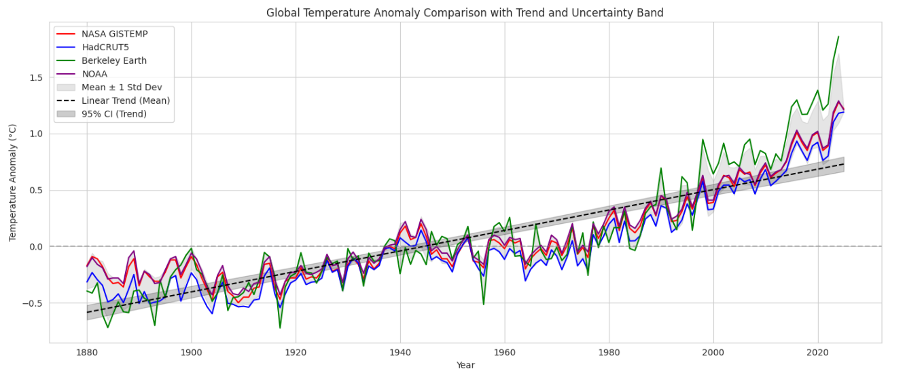


- **Global Atmospheric CO₂ Trend (NOAA):**  
  Shows the steady, accelerating rise in global annual mean atmospheric CO₂ since 1980. The plot includes annual mean values (with uncertainty), 5-year and 10-year rolling averages for smoothing.

  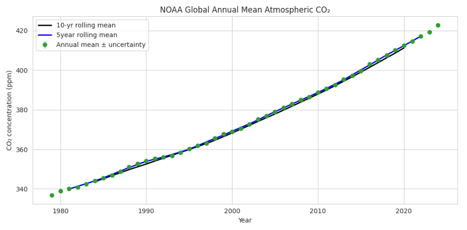

- **Volcanic Aerosols (SAOD) Trend:**  
  Depicts annual global stratospheric aerosol optical depth (SAOD) since 1985, with clear peaks corresponding to major volcanic eruptions (e.g., Mt. Pinatubo in 1991). Includes 5-year and 10-year rolling means to highlight long-term patterns. 

  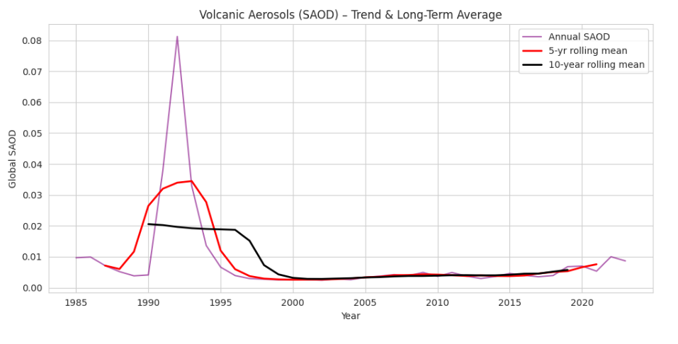

- **Solar Irradiance (TSI) Over Time:**  
  Displays annual total solar irradiance (TSI) from 1610 to present, revealing both long-term variability and decadal solar cycles that contribute to natural climate variability.

  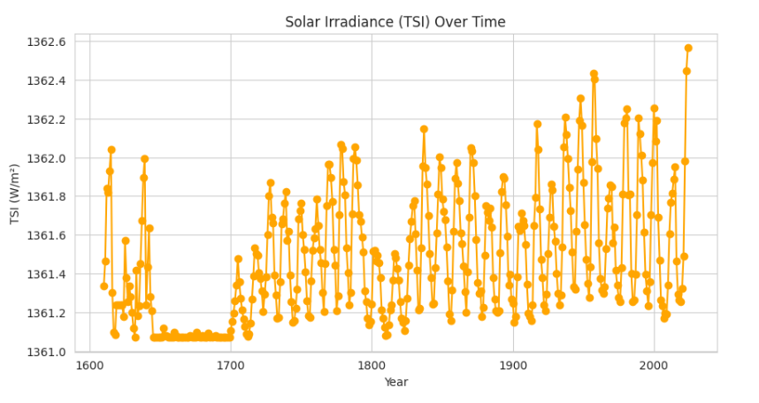


- **Methane (CH₄) Concentration and Rolling Average:**  
  Shows the steady increase in atmospheric methane levels since the 1980s, with a 5-year rolling mean highlighting the accelerating growth in recent decades.

  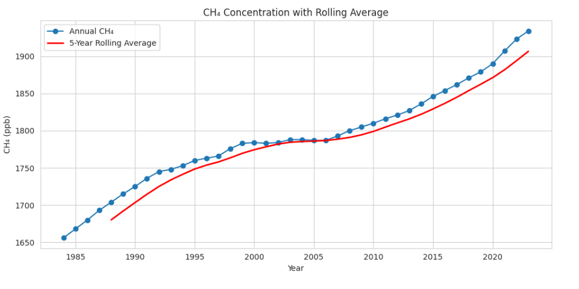


- **Nitrous Oxide (N₂O) Concentration and Rolling Average:**  
  Shows the continuous rise in atmospheric nitrous oxide concentrations from the 1980s to present, with a 5-year rolling mean emphasizing the steady upward trend.

  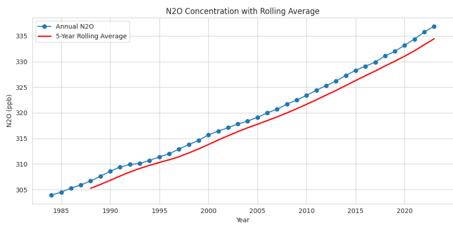

Each figure is labeled and briefly discussed in the notebook. EDA confirms strong upward trends in CO₂ and temperature, with no comparable trend in solar or volcanic variables.

---

## Statistical & Machine Learning Analysis

- **Correlation Analysis:**  
  We calculate Pearson, Spearman, and Kendall tau correlations for every major variable pair. Partial correlations (controlling for time) are used to separate long-term and short-term effects.

- **Regression Modeling:**  
  We fit linear regression models and apply ensemble methods (Random Forest, XGBoost) to predict temperature anomaly based on all engineered features.  
  Model metrics (R², RMSE) are reported for both training and validation sets.

- **Interpretability:**  
  SHAP (SHapley Additive exPlanations) values and feature importance scores from tree models reveal which variables most influence predictions. This helps quantify the dominant climate drivers.

- **Robustness Checks:**  
  Analyses are repeated using different periods and model types to verify the stability of results.

---

## Feature Engineering

To maximize the models' ability to detect patterns and causality, the following feature engineering techniques were applied:

### 1. First Differences (Δ Variables)

Year-on-year change features quantify how much each variable changes from one year to the next, capturing trend accelerations or sudden shifts.

| Feature Name    | Description                                                 |
|-----------------|------------------------------------------------------------|
| Delta_CO2       | Year-on-year change in atmospheric CO₂ concentration       |
| Delta_Temp      | Year-on-year change in global temperature anomaly          |
| Delta_TSI       | Year-on-year change in total solar irradiance              |
| Delta_SAOD      | Year-on-year change in volcanic aerosol optical depth      |

### 2. Lag Features

Lagged features capture the value of each climate driver from the previous year, enabling the detection of delayed responses or memory effects within the climate system.

| Feature Name    | Description                                        |
|-----------------|---------------------------------------------------|
| CO2_lag1        | Previous year's CO₂ concentration                 |
| Temp_lag1       | Previous year's global temperature anomaly        |
| TSI_lag1        | Previous year's total solar irradiance            |
| SAOD_lag1       | Previous year's volcanic aerosol optical depth    |

### 3. Interaction Terms

Interaction features are constructed by multiplying pairs of drivers, allowing the analysis to capture synergistic, antagonistic, or nonlinear combined effects.

| Feature Name   | Description                                                            |
|----------------|------------------------------------------------------------------------|
| CO2_x_TSI      | Product of CO₂ concentration and solar irradiance                      |
| CO2_x_SAOD     | Product of CO₂ concentration and volcanic aerosol optical depth        |
| TSI_x_SAOD     | Product of solar irradiance and volcanic aerosol optical depth         |

### 4. Rolling Statistics

Rolling window features smooth out short-term noise and emphasize persistent, multi-year trends or volatility in climate variables.

| Feature Name        | Description                                                       |
|---------------------|-------------------------------------------------------------------|
| RollingMean_Temp    | Multi-year (e.g., 5-year) rolling average of temperature anomaly  |
| RollingStd_Temp     | Multi-year rolling standard deviation of temperature anomaly      |

### 5. Standardized Anomalies

Standardizing features (z-scores) expresses values relative to their historical mean and standard deviation, highlighting extreme or outlier years.

| Feature Name   | Description                                                        |
|----------------|--------------------------------------------------------------------|
| Zscore_Temp    | Standardized (z-score) global temperature anomaly                  |


**These steps enhance both predictive accuracy and the interpretability of relationships between drivers**

---

## Key Results & Visualizations

- **Nonlinear (Quadratic) Fit: CO₂ vs Temperature Anomaly:**  
  Illustrates the nonlinear relationship between atmospheric CO₂ concentration and global temperature anomaly, with a quadratic model capturing the upward curvature as CO₂ increases.
 
  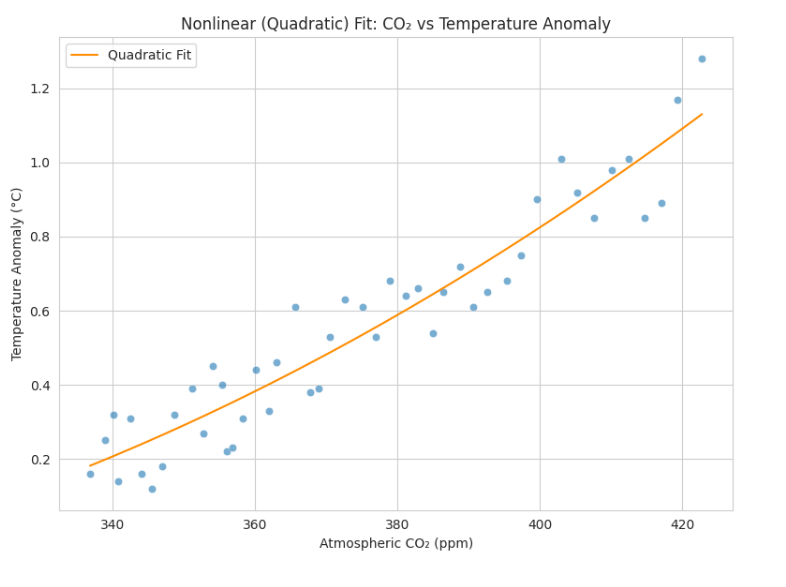  

- **No Long-Term Correlation for Volcanic or Solar Drivers:**  
  CO₂ vs SAOD and CO₂ vs TSI; Time series overlays show no persistent alignment 

  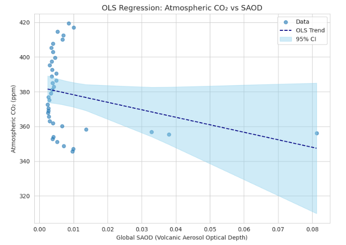  
  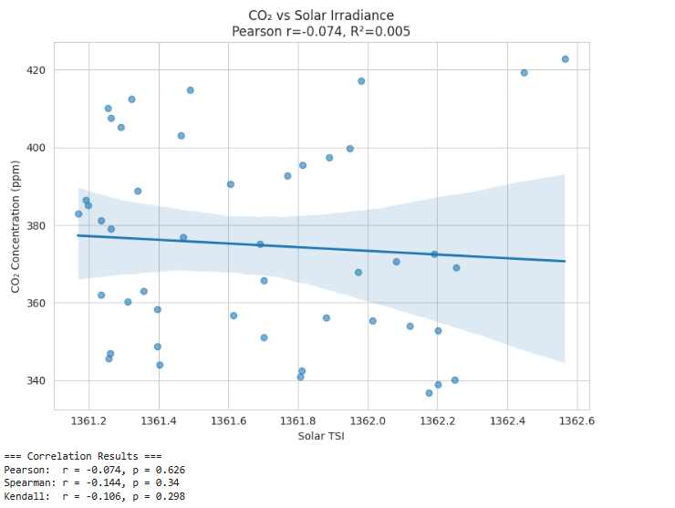


- **Methane vs Temperature Anomaly:**  
  Shows the strong positive correlation between atmospheric methane (CH₄) concentrations and global temperature anomaly. The regression line and shaded 95% confidence interval highlight how increasing CH₄ is closely linked to rising temperatures.

  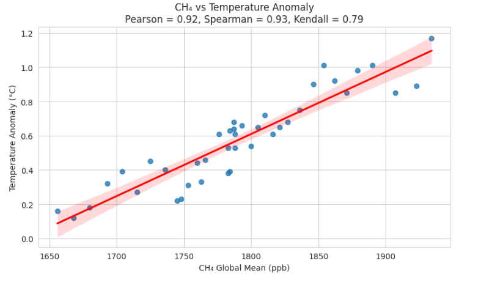

- **Nitrous Oxide vs Temperature Anomaly:**  
  Demonstrates the strong positive relationship between atmospheric nitrous oxide (N₂O) concentrations and global temperature anomaly. The regression line and 95% confidence band illustrate how increases in N₂O are tightly associated with higher global temperatures.

  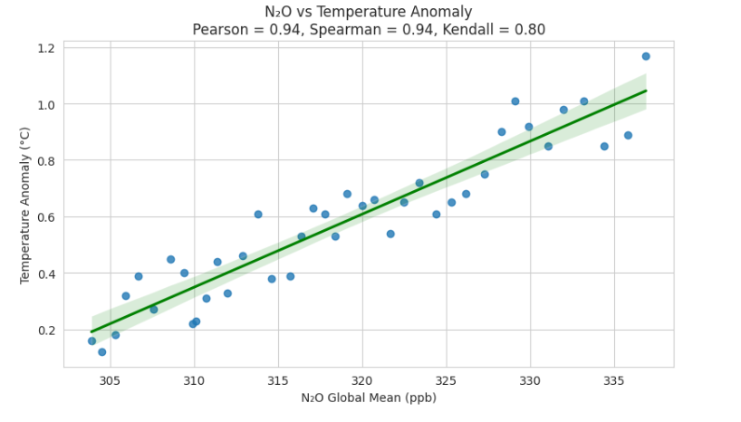

- **SHAP Feature Importance (Random Forest):**

  Highlights which engineered climate features are most influential in the Random Forest prediction of temperature anomaly. The strongest effect comes from the interaction between atmospheric CO₂ and solar irradiance.

  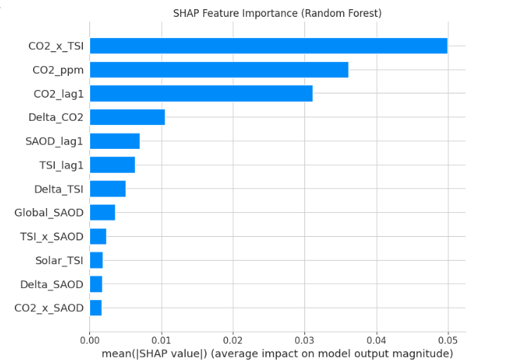

- **SHAP Feature Importance (XGBoost):**

  Shows the relative importance of climate features for temperature prediction in the XGBoost model. Atmospheric CO₂ concentration stands out as the most important single feature.

  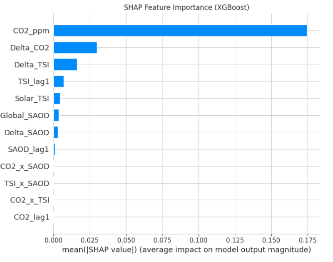


- **SHAP Feature Importance by Model:**  
  The plots below display the mean SHAP values for each feature across different Random Forest and XGBoost models.  
  They reveal that atmospheric CO₂ is the dominant predictor of temperature anomaly, while volcanic and solar variables have much smaller effects.  
  This model-independent analysis strengthens the conclusion that rising CO₂ is the main driver of recent global warming.

  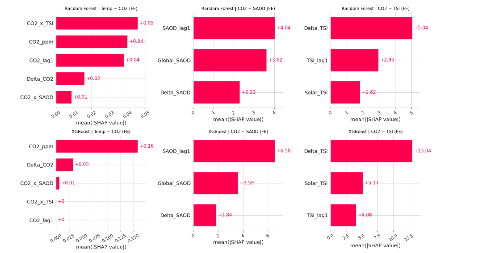
---

## Conclusion

This project provides a comprehensive, data-driven examination of the key drivers behind recent global warming. By integrating long-term datasets on temperature anomalies, atmospheric CO₂, volcanic aerosols, and solar irradiance, and applying both classical statistical methods and modern machine learning, we draw several important conclusions:

- **CO₂–Temperature Link Is Robust:**  
  Our analysis consistently finds a strong, statistically significant correlation between rising atmospheric CO₂ levels and increases in global surface temperatures. This relationship holds across multiple datasets, statistical methods, and is further confirmed by regression and machine learning models, where CO₂ emerges as the dominant feature influencing temperature predictions.

- **Volcanic and Solar Effects Are Limited:**  
  While volcanic eruptions (as measured by SAOD) can cause temporary cooling, and solar irradiance (TSI) shows some natural variability, neither factor explains the sustained, long-term increase in CO₂ or temperature since the mid-20th century. Correlation analyses and feature importance results from machine learning models confirm these natural drivers are minor contributors compared to CO₂.

- **Human Activity Is the Main Driver:**  
  The temporal alignment between industrial-era CO₂ emissions and global temperature rise, combined with the lack of any strong natural forcing trend, provides compelling evidence that human activities especially fossil fuel combustion—are responsible for modern global warming.

- **Methodological Strength:**  
  The combination of feature engineering, rigorous EDA, multiple correlation metrics, and advanced ML modeling provides a robust and reproducible workflow for climate data analysis. Results are stable across different approaches, boosting confidence in the scientific conclusions.

- **Policy Implications:**  
  Our findings strongly support the scientific consensus that urgent reductions in anthropogenic CO₂ emissions are necessary to slow and eventually halt global warming. Further work can build on this analysis by exploring regional impacts, extreme weather events, or the effects of mitigation strategies.

**In summary:**  
Neither volcanic activity nor solar changes account for the persistent, accelerating trends in global CO₂ and temperature. The evidence from this project overwhelmingly attributes recent global warming to human-driven increases in atmospheric CO₂. Continued data-driven research and effective climate policy are essential to address this pressing global challenge.

---

## Future Work

- Develop real-time prediction and monitoring tools by automating data collection, model updates, and dashboard visualizations, enabling timely assessment of global warming trends as new data becomes available.
- Incorporate additional human-related factors such as land use change, deforestation, and urbanization.
- Integrate major climate oscillations, such as the El Niño–Southern Oscillation (ENSO), to better capture the impact of natural variability on global temperature and climate extremes.

---

## How to Run

1. Make sure Python 3.8 or higher is installed on your system.
2. Install all required Python libraries by running:
    ```bash
    pip install pandas numpy matplotlib seaborn scikit-learn xgboost shap
    ```
3. Place `Project_GW.ipynb` and any necessary data files in the same directory.
4. Open Jupyter Notebook or JupyterLab, navigate to the project folder, and open `Project_GW.ipynb`.
5. Run all cells in sequence.  
   - All plots and graphs will display directly in the notebook as output.

---

## Requirements

- Python 3.8+
- pandas
- numpy
- matplotlib
- seaborn
- scikit-learn
- xgboost
- shap

---

## References

- [NASA GISTEMP](https://data.giss.nasa.gov/gistemp/)
- [Berkeley Earth](http://berkeleyearth.org/data/)
- [HadCRUT5](https://www.metoffice.gov.uk/hadobs/hadcrut5/)
- [NOAA CO₂ Trends](https://gml.noaa.gov/ccgg/trends/)
- [Solar TSI](https://data.giss.nasa.gov/modelforce/solar.irradiance/)
- [NASA Volcanic Aerosol](https://data.giss.nasa.gov/modelforce/strataer/)
- [N₂O and CH₄ Dataset](https://gaw.kishou.go.jp/publications/global_mean_mole_fractions)

---

## Contributors

This project was developed as a collaborative effort by:

- **Navya Zacharia** ([nzacharia41@gmail.com](mailto:nzacharia41@gmail.com))  
- **Vishnu Vijayakumar** ([vishnuvijayakumar40@gmail.com](mailto:vishnuvijayakumar40@gmail.com))  

We worked together on all stages of the project from data collection and analysis to modeling and presentation to ensure robust and reproducible results. 

---