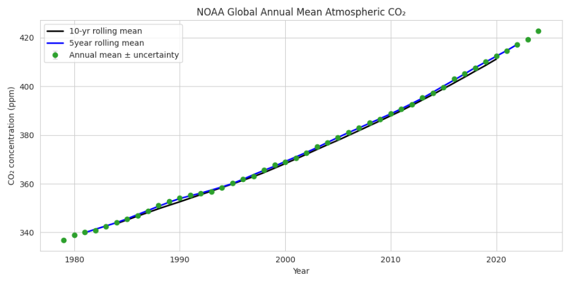
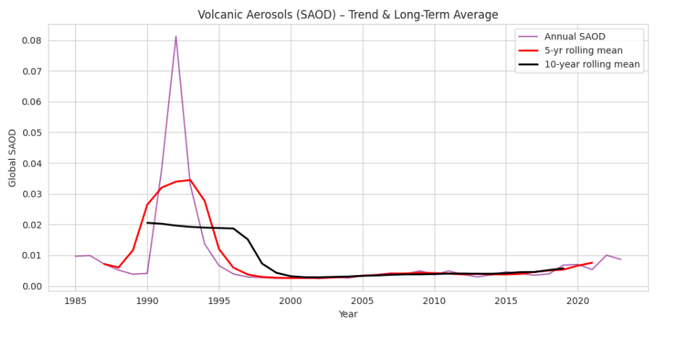
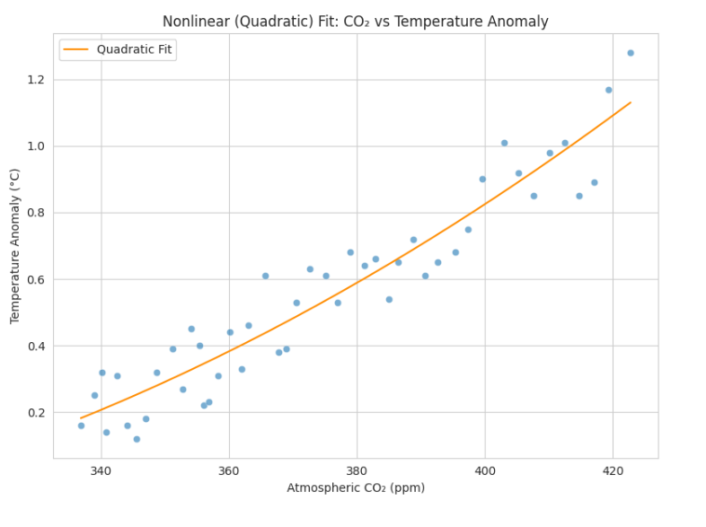
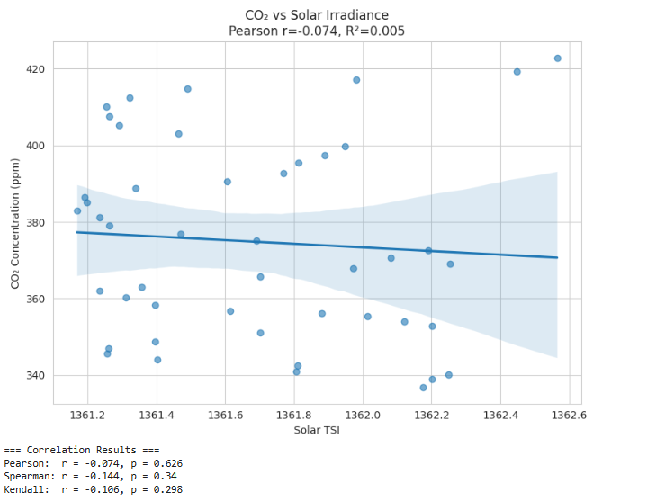

<p align="center">
  
</p>

<h1 align="center">Analyzing Global Warming Using Machine Learning and Climate Data</h1>

<p align="center">
  <b>
    Climate change is one of the most pressing challenges of our time. While the evidence for global warming is clear, the debate often centers on its primary causes: are they driven by human activity or by natural factors like volcanic eruptions or solar variation?  
This project uses transparent, reproducible data science and modeling to rigorously test the links between atmospheric CO₂, volcanic activity, solar irradiance, and global temperature anomalies.  
Our findings support evidence-based climate policy and seek to advance scientific understanding of Earth's changing climate.
  </b>
</p>


## Table of Contents
1. [Project Overview](#project-overview)
2. [Motivation](#motivation)
3. [Dataset Description](#dataset-description)
4. [Feature Engineering](#feature-engineering)
5. [Exploratory Data Analysis (EDA)](#exploratory-data-analysis-eda)
6. [Statistical & Machine Learning Analysis](#statistical--machine-learning-analysis)
7. [Key Results & Visualizations](#key-results--visualizations)
8. [Conclusion](#conclusion)
9. [Requirements](#requirements)
10. [References](#references)

---

## Project Overview

This project investigates the fundamental question: **Is modern global warming mainly caused by human activity or by natural factors?**  
To answer this, we analyze and integrate multiple global climate datasets focusing on surface temperature anomalies, atmospheric CO₂ concentrations, volcanic aerosol optical depth (SAOD), and solar irradiance (TSI). By combining these diverse sources, we can rigorously quantify the relationships and potential causal links between climate variables over time.

We rely primarily on NASA's GISTEMP dataset for global temperature anomaly measurements because it offers one of the most comprehensive, long-term, and quality-controlled records of global surface temperatures, with coverage back to 1880. Using NASA's temperature data as the reference point allows us to accurately align and compare climate drivers from other datasets. In our **feature engineering**, NASA's dataset is crucial: we merge it with CO₂, SAOD, and TSI data on a yearly basis to generate engineered features such as year-on-year differences, lags, and interaction terms. This process ensures all features are temporally and spatially consistent, maximizing the reliability and interpretability of our subsequent analysis.

By applying both classical statistics and advanced machine learning techniques to this merged dataset, we provide a robust, data-driven assessment of the dominant factors influencing global temperature trends and ultimately, the causes of recent global warming.

---

## Motivation

Climate change is one of the defining issues of our era. Although global warming is widely discussed, public debate persists over the respective roles of human-driven greenhouse gas emissions and natural influences like volcanic eruptions or solar variability.  
This project aims to move beyond opinion by using transparent data science methods to assess the real-world drivers of recent climate change. The results are meant to support evidence-based climate policy and increase scientific literacy.

---

## Dataset Description

We integrate multiple authoritative, open-access datasets covering over a century of climate observations:

- **NASA GISTEMP:** Annual global temperature anomalies, based on combined land and sea surface measurements.  
  _Period:_ 1880-Present.  
- **NOAA Mauna Loa CO₂:** Monthly and annual atmospheric CO₂ concentrations from direct measurements.  
  _Period:_ 1958-Present.  
- **NASA/NOAA Volcanic SAOD:** Stratospheric Aerosol Optical Depth as a measure of volcanic activity's effect on climate.  
  _Period:_ 1850-Present.  
- **PMOD/WRC TSI:** Annual average total solar irradiance data, indicating changes in solar output.  
  _Period:_ 1978-Present.  

All datasets are resampled to a common annual scale and merged on the "Year" variable, ensuring full alignment for analysis.

---

## Feature Engineering

To maximize the models' ability to detect patterns and causality, the following feature engineering techniques were applied:

- **First Differences:** Captures year-on-year changes (e.g., ΔCO₂), highlighting trends and abrupt shifts.
- **Lagged Variables:** Incorporates one-year lag values to capture delayed or memory effects in the climate system.
- **Interaction Terms:** Includes cross-features such as CO₂ x TSI to examine if combined effects exist.
- **Rolling Means and Z-Scores:** Provides smoothed trends and normalized variables, making comparisons meaningful.

_These steps enhance both predictive accuracy and the interpretability of relationships between drivers._

---

## Exploratory Data Analysis (EDA)

Initial EDA provides critical context for the deeper analysis:

- **Global Temperature Anomaly Trend:**  
  Shows the steady increase in global temperatures since 1880, with a linear trend line and 95% confidence interval.

  

- **Atmospheric CO₂ Trend:**  
  Illustrates the rapid rise in atmospheric CO₂ concentrations from 1980 to present, alongside a fitted linear trend showing an average increase of nearly 1.9 ppm per year.

  

- **Volcanic Aerosol (SAOD) Trend:**  
  Displays annual and 10-year average stratospheric aerosol optical depth, revealing the impact of major volcanic eruptions (e.g., early 1990s) and the lack of any sustained long-term trend.  

  

- **Distribution of Solar Irradiance (TSI):**  
  Shows the distribution of total solar irradiance (TSI) values over the analysis period, with a clear peak and skew toward lower values. This plot helps assess whether solar variability could explain temperature or CO₂ trends.

  

Each figure is labeled and briefly discussed in the notebook. EDA confirms strong upward trends in CO₂ and temperature, with no comparable trend in solar or volcanic variables.

---

## Statistical & Machine Learning Analysis

- **Correlation Analysis:**  
  We calculate Pearson, Spearman, and Kendall tau correlations for every major variable pair. Partial correlations (controlling for time) are used to separate long-term and short-term effects.

- **Regression Modeling:**  
  We fit linear regression models and apply ensemble methods (Random Forest, XGBoost) to predict temperature anomaly based on all engineered features.  
  Model metrics (R², RMSE) are reported for both training and validation sets.

- **Interpretability:**  
  SHAP (SHapley Additive exPlanations) values and feature importance scores from tree models reveal which variables most influence predictions. This helps quantify the dominant climate drivers.

- **Robustness Checks:**  
  Analyses are repeated using different periods and model types to verify the stability of results.

---

## Key Results & Visualizations

- **CO₂ Drives Temperature:**  
  _Scatter plot and regression line: Atmospheric CO₂ vs Global Temperature Anomaly._  
    
  _Finding:_ The relationship is strongly linear (r ≈ 0.95), with little scatter.

- **No Long-Term Correlation for Volcanic or Solar Drivers:**  
  _Scatter plots: CO₂ vs SAOD and CO₂ vs TSI; Time series overlays show no persistent alignment._  
    
  

- **Model Performance — Multiple Approaches:**  
  Comparison of observed global temperature anomaly with predictions from several modeling techniques (Linear, Polynomial, Mixed-Effects, XGBoost, Gaussian Process). All models capture the accelerating warming trend since 1850, and ensemble agreement boosts confidence in the results.  
  

- **Correlation Matrix of Climate Variables:**  
  The heatmap below visualizes all pairwise correlations between both raw and engineered climate variables. It highlights the strong relationship between CO₂ and temperature, and the much weaker/no correlations for volcanic and solar drivers.

  
  

- **SHAP Feature Importance by Model:**  
  The plots below display the mean SHAP values for each feature across different Random Forest and XGBoost models.  
  They reveal that atmospheric CO₂ is the dominant predictor of temperature anomaly, while volcanic and solar variables have much smaller effects.  
  This model-independent analysis strengthens the conclusion that rising CO₂ is the main driver of recent global warming.

  
---

## Conclusion

This project provides a comprehensive, data-driven examination of the key drivers behind recent global warming. By integrating long-term datasets on temperature anomalies, atmospheric CO₂, volcanic aerosols, and solar irradiance, and applying both classical statistical methods and modern machine learning, we draw several important conclusions:

- **CO₂–Temperature Link Is Robust:**  
  Our analysis consistently finds a strong, statistically significant correlation between rising atmospheric CO₂ levels and increases in global surface temperatures. This relationship holds across multiple datasets, statistical methods, and is further confirmed by regression and machine learning models, where CO₂ emerges as the dominant feature influencing temperature predictions.

- **Volcanic and Solar Effects Are Limited:**  
  While volcanic eruptions (as measured by SAOD) can cause temporary cooling, and solar irradiance (TSI) shows some natural variability, neither factor explains the sustained, long-term increase in CO₂ or temperature since the mid-20th century. Correlation analyses and feature importance results from machine learning models confirm these natural drivers are minor contributors compared to CO₂.

- **Human Activity Is the Main Driver:**  
  The temporal alignment between industrial-era CO₂ emissions and global temperature rise, combined with the lack of any strong natural forcing trend, provides compelling evidence that human activities especially fossil fuel combustion—are responsible for modern global warming.

- **Methodological Strength:**  
  The combination of feature engineering, rigorous EDA, multiple correlation metrics, and advanced ML modeling provides a robust and reproducible workflow for climate data analysis. Results are stable across different approaches, boosting confidence in the scientific conclusions.

- **Policy Implications:**  
  Our findings strongly support the scientific consensus that urgent reductions in anthropogenic CO₂ emissions are necessary to slow and eventually halt global warming. Further work can build on this analysis by exploring regional impacts, extreme weather events, or the effects of mitigation strategies.

**In summary:**  
Neither volcanic activity nor solar changes account for the persistent, accelerating trends in global CO₂ and temperature. The evidence from this project overwhelmingly attributes recent global warming to human-driven increases in atmospheric CO₂. Continued data-driven research and effective climate policy are essential to address this pressing global challenge.

---

## How to Run

1. Make sure Python 3.8 or higher is installed on your system.
2. Install all required Python libraries by running:
    ```bash
    pip install pandas numpy matplotlib seaborn scikit-learn xgboost shap
    ```
3. Place `Project_GW.ipynb` and any necessary data files in the same directory.
4. Open Jupyter Notebook or JupyterLab, navigate to the project folder, and open `Project_GW.ipynb`.
5. Run all cells in sequence.  
   - All plots and graphs will display directly in the notebook as output.

---

## Requirements

- Python 3.8+
- pandas
- numpy
- matplotlib
- seaborn
- scikit-learn
- xgboost
- shap

---

## References

- [NASA GISTEMP](https://data.giss.nasa.gov/gistemp/)
- [NOAA CO₂ Trends](https://gml.noaa.gov/ccgg/trends/)
- [PMOD/WRC TSI](https://www.pmodwrc.ch/en/)
- [NASA Volcanic Aerosol](https://data.giss.nasa.gov/modelforce/strataer/)

---
